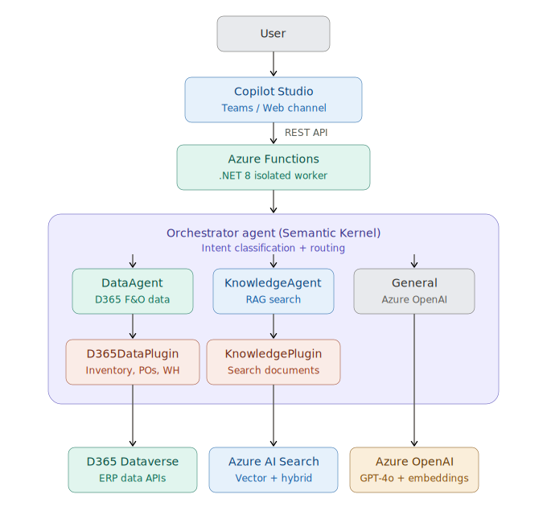

# D365 Intelligent Operations Copilot

A production-grade, multi-agent AI command center built on the Microsoft AI stack for Dynamics 365 Finance & Operations.

## Overview

This project demonstrates a multi-agent architecture where specialized AI agents collaborate to answer operational queries, retrieve company policies, and provide data-driven insights — all accessible through Microsoft Copilot Studio.

## Architecture
```


User → Copilot Studio → Azure Function → Orchestrator Agent
                                              ├── DataAgent (D365 F&O inventory, POs, warehouses)
                                              ├── KnowledgeAgent (RAG over SOPs & policies via Azure AI Search)
                                              └── General Knowledge (Azure OpenAI)
```

### How It Works

1. **User** asks a question in Copilot Studio (Teams, Web, or custom channel)
2. **Copilot Studio** forwards the message to an Azure Function via REST API
3. **OrchestratorAgent** classifies intent (data / knowledge / both / general) using GPT-4o
4. **Specialized agents** are invoked in parallel when needed:
   - **DataAgent** — Retrieves D365 F&O operational data (inventory, purchase orders, warehouse summaries)
   - **KnowledgeAgent** — Performs RAG search over indexed company documents (SOPs, procurement guidelines, warehouse operations manuals)
5. **Orchestrator** synthesizes multi-agent responses into a single coherent answer
6. **Response** flows back through Copilot Studio to the user

## Tech Stack

| Layer | Technology |
|---|---|
| **Frontend** | Microsoft Copilot Studio |
| **API** | Azure Functions (.NET 8 Isolated Worker) |
| **Orchestration** | Semantic Kernel (C#) |
| **AI Model** | Azure OpenAI (GPT-4o) |
| **Vector Search** | Azure AI Search (Hybrid + Vector) |
| **Embeddings** | Azure OpenAI (text-embedding-3-large) |
| **AI Platform** | Azure AI Foundry |
| **ERP** | Microsoft Dynamics 365 F&O (Dataverse API) |
| **Infrastructure** | Azure (Sweden Central) |

## Project Structure
```
d365-intelligent-ops-copilot/
├── src/
│   ├── D365OpsCopilot.Functions/     # Azure Functions HTTP API
│   ├── D365OpsCopilot.Agents/        # Multi-agent orchestration (Semantic Kernel)
│   ├── D365OpsCopilot.Plugins/       # SK Plugins (D365 Data, Knowledge Search)
│   ├── D365OpsCopilot.Shared/        # Shared models and DTOs
│   └── D365OpsCopilot.Indexer/       # Document indexing pipeline
├── infra/                             # Bicep / ARM templates
├── docs/                              # Architecture diagrams, OpenAPI spec
├── data/                              # Sample SOPs and policy documents
├── .env.example
├── README.md
└── D365OpsCopilot.sln
```

## Key Features

- **Multi-Agent Architecture** — Orchestrator classifies intent and routes to specialized agents
- **Parallel Agent Execution** — Data and Knowledge agents run concurrently for complex queries
- **RAG Pipeline** — Company documents chunked, embedded, and indexed in Azure AI Search
- **Auto Function Calling** — Semantic Kernel enables GPT-4o to dynamically invoke the right plugin
- **Copilot Studio Integration** — Enterprise-ready conversational UI via REST API connector
- **Response Synthesis** — Orchestrator combines multi-agent outputs into coherent answers

## Agents

### DataAgent
Retrieves operational data from D365 F&O including:
- Inventory levels by SKU across warehouses
- Purchase order tracking by status
- Warehouse capacity and transfer summaries

### KnowledgeAgent
Answers policy and procedure questions using RAG:
- Procurement approval matrix
- Inventory management policies (reorder points, dead stock, cycle counting)
- Warehouse operations (receiving, picking, packing, KPI targets)

### OrchestratorAgent
- Classifies user intent into: data, knowledge, both, or general
- Routes to appropriate agent(s)
- Synthesizes responses when multiple agents are invoked

## Prerequisites

- .NET 8 SDK
- Azure Subscription with:
  - Azure OpenAI Service (GPT-4o + text-embedding-3-large)
  - Azure AI Search (Basic tier)
  - Azure Functions
  - Azure AI Foundry project
- Microsoft Copilot Studio license
- Azure Functions Core Tools v4

## Getting Started

1. Clone the repository
2. Copy `.env.example` to configure `local.settings.json` in the Functions project
3. Provision Azure resources (see Prerequisites)
4. Run the document indexer:
```bash
   cd src/D365OpsCopilot.Indexer
   dotnet run
```
5. Start the function locally:
```bash
   cd src/D365OpsCopilot.Functions
   func start
```
6. Test with curl:
```bash
   curl -X POST http://localhost:7071/api/Chat \
     -H "Content-Type: application/json" \
     -d '{"Message": "What is the inventory level for SKU-12345?"}'
```

## Sample Queries

| Query | Agent Used | Description |
|---|---|---|
| "What is the inventory for SKU-12345?" | DataAgent | Retrieves mock inventory data across warehouses |
| "What is the PO approval process?" | KnowledgeAgent | RAG search over procurement guidelines |
| "How much SKU-5001 do we have and what is our dead stock policy?" | Both | Parallel execution + response synthesis |
| "What are the benefits of ERP systems?" | General | Direct Azure OpenAI response |

## Author

**Abdullah Agha** — Enterprise Solution Architect & AI Developer
- 12+ years in Microsoft Dynamics 365, Azure Integration, and Enterprise AI
- GitHub: [@abdullahaghaMAF](https://github.com/abdullahaghaMAF)